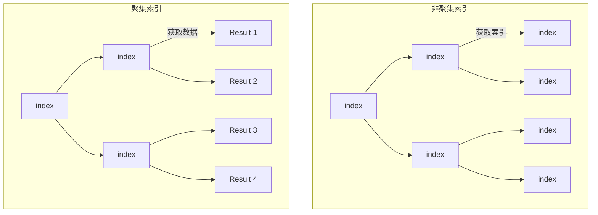

# 聚集索引和非聚集索引

## 聚集索引  Clustered

聚集（clustered）索引，也叫聚簇索引。

数据物理存储顺序与索引列的顺序相同，所以一个表只能拥有一个聚集索引。聚簇索引的叶节点包含数据页。There are clustered and nonclustered indexes. A clustered index is a special type of index that reorders the way records in the table are physically stored. Therefore table can have only one clustered index. The leaf nodes of a clustered index contain the data pages.

## 非聚集索引

数据物理存储顺序与索引顺序无关，非聚集索引的叶节点不包含数据页。相反，叶节点包含索引行。

A nonclustered index is a special type of index in which the logical order of the index does not match the physical stored order of the rows on disk. The leaf node of a nonclustered index does not consist of the data pages. Instead, the leaf nodes contain index rows.

**非聚集索引和聚集索引的区别** 在于， 通过聚集索引可以查到需要查找的数据， 而通过非聚集索引可以查到记录对应的主键值 ， 再使用主键的值通过聚集索引查找到需要的数据 

**以InnoDB为例子，非聚集索引 最终都会利用主键通过聚集索引来定位到数据**

## 主键和聚集索引的关系

聚集索引并不一定是主键，也不一定是唯一索引。它和数据库的引擎相关，数据库引擎设计的不同，带来不同。

通常，每个表中会建立自增的ID列区分每条数据。如果将这个列设为主键，SQL SERVER会将此列默认为聚集索引。数据在数据库中会按照ID进行物理排序。  

## 有效利用聚集索引          

聚集索引的优势是很明显的，而每个表中只能有一个聚集索引的规则，这使得聚集索引变得更加珍贵。      

聚集索引的定义，使用聚集索引的最大好处就是能够根据查询要求，迅速缩小查询范围，避免全表扫描。在实际应用中，因为ID号是自动生成的，我们并不知道每条记录的ID号，所以我们很难在实践中用ID号来进行查询。这就使让ID号这个主键作为聚集索引成为一种资源浪费。其次，让每个ID号都不同的字段作为聚集索引也不符合"大数目的不同值情况下不应建立聚合索引"规则；当然，这种情况只是针对用户经常修改记录内容，特别是索引项的时候会负作用，但对于查询速度并没有影响。      

假设，业务上每次每个用户打开首页查询历史订单的时候都进行一次全表扫描，这样做意义是不大的，绝大多数的用户1个月前的文件都已经浏览过了，这样做只能徒增数据库的开销而已。事实上，我们完全可以让用户打开系统首页时，数据库仅仅查询这个用户近3个月来未阅览的文件，通过"日期"这个字段来限制表扫描，提高查询速度。如果系统已经建立的2年，那么您的首页显示速度理论上将是原来速度8倍，甚至更快。"理论上"三字，是因为如果您的聚集索引还是盲目地建在ID这个主键上时，您的查询速度是没有这么高的，即使您在"日期"这个字段上建立的索引（非聚合索引）。

看一下在1000万条数据量的情况下各种查询的速度表现（3个月内的数据为25万条）：      

（1）仅在主键上建立聚集索引，并且不划分时间段：

Select gid,fariqi,neibuyonghu,title from tgongwen  用时：128470毫秒（即：128秒）      

（2）在主键上建立聚集索引，在fariq上建立非聚集索引：     

select gid,fariqi,neibuyonghu,title from Tgongwen where  fariqi> dateadd(day,-90,getdate())   用时：53763毫秒（54秒）      

（3）将聚合索引建立在日期列（fariqi）上：     

select gid,fariqi,neibuyonghu,title from Tgongwen where  fariqi> dateadd(day,-90,getdate()) 用时：2423毫秒（2秒）      

虽然每条语句提取出来的都是25万条数据，各种情况的差异却是巨大的，特别是将聚集索引建立在日期列时的差异。事实上，如果您的数据库真的有1000万容量的话，把主键建立在ID列上，就像以上的第1、2种情况，在网页上的表现就是超时，根本就无法显示。这也是我摒弃ID列作为聚集索引的一个最重要的因素。     

得出以上速度的方法是：在各个select语句前加：declare @d datetime set @d=getdate()      

并在select语句后加：     

select [语句执行花费时间(毫秒)]=datediff(ms,@d,getdate())   

## 聚集索引带来的问题

（1）聚集索引适合用于需要进行范围查找的列，因为聚集索引的叶子节点存放的是有序的数据行，查询引擎可根据WHERE中给出的范围，直接定位到两端的叶子节点，将这部分节点页的数据根据链表顺序取出即可；

（2）聚集索引尽量建立在值不会发生变更的列上，否则会带来非聚集索引的维护；

（3）尽量在建立非聚集索引之前建立聚集索引，否则会导致表上所有非聚集索引的重建；

（4）聚集索引应该避免建立在数值单调的列上，否则可能会造成IO的竞争，以及B树的不平衡，从而导致数据库系统频繁的维护B树的平衡性。聚集索引的列值最好能够在表中均匀分布。

## InnoDB 引擎下的设计

#### 15.6.2.1 Clustered and Secondary Indexes

Every `InnoDB` table has a special index called the [clustered index](https://dev.mysql.com/doc/refman/8.0/en/glossary.html#glos_clustered_index) where the data for the rows is stored. Typically, the clustered index is synonymous with the [primary key](https://dev.mysql.com/doc/refman/8.0/en/glossary.html#glos_primary_key). To get the best performance from queries, inserts, and other database operations, you must understand how `InnoDB` uses the clustered index to optimize the most common lookup and DML operations for each table.

- When you define a `PRIMARY KEY` on your table, `InnoDB` uses it as the clustered index. Define a primary key for each table that you create. If there is no logical unique and non-null column or set of columns, add a new [auto-increment](https://dev.mysql.com/doc/refman/8.0/en/glossary.html#glos_auto_increment) column, whose values are filled in automatically.
- If you do not define a `PRIMARY KEY` for your table, MySQL locates the first `UNIQUE` index where all the key columns are `NOT NULL` and `InnoDB`uses it as the clustered index.
- If the table has no `PRIMARY KEY` or suitable `UNIQUE` index, `InnoDB` internally generates a hidden clustered index named `GEN_CLUST_INDEX` on a synthetic column containing row ID values. The rows are ordered by the ID that `InnoDB` assigns to the rows in such a table. The row ID is a 6-byte field that increases monotonically as new rows are inserted. Thus, the rows ordered by the row ID are physically in insertion order.

##### How the Clustered Index Speeds Up Queries

Accessing a row through the clustered index is fast because the index search leads directly to the page with all the row data. If a table is large, the clustered index architecture often saves a disk I/O operation when compared to storage organizations that store row data using a different page from the index record.

##### How Secondary Indexes Relate to the Clustered Index

All indexes other than the clustered index are known as [secondary indexes](https://dev.mysql.com/doc/refman/8.0/en/glossary.html#glos_secondary_index). In `InnoDB`, each record in a secondary index contains the primary key columns for the row, as well as the columns specified for the secondary index. `InnoDB` uses this primary key value to search for the row in the clustered index.

If the primary key is long, the secondary indexes use more space, so it is advantageous to have a short primary key.

For guidelines to take advantage of `InnoDB` clustered and secondary indexes, see [Section 8.3, “Optimization and Indexes”](https://dev.mysql.com/doc/refman/8.0/en/optimization-indexes.html).

from https://dev.mysql.com/doc/refman/8.0/en/innodb-index-types.html

## 参考：

https://blog.csdn.net/ak913/article/details/8026743 文中对聚集和非聚集进行了分析

https://www.jianshu.com/p/f6e4091be10e 比较清晰地说明了聚集索引，覆盖索引，覆盖索引的概念，但是整个是基于innoDB 的分析，但是作者没有点出来。

[Mysql聚集索引和非聚集索引(堆组织表和索引组织表)](https://blog.csdn.net/ochangwen/article/details/53997366)

